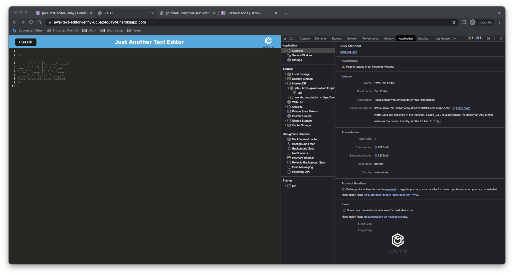

# 19 Progressive Web Applications (PWA): Jenny Naoroji's Text Editor

## Description

My task was to build a text editor that runs in the browser. This single-page application that meets the PWA criteria. 

Additionally, it will feature a number of data persistence techniques that serve as redundancy in case one of the options is not supported by the browser. The application will also function offline.

This application will implement methods for getting anf storing data to an IndexedDB database. A lightweight wrapper package called `idb` will be used to feature methods that are useful for storing and retrieving data.

This full-stack application will be deployed to Heroku.

## Usage

To use this application visit the Heroku deployment link!
- https://pwa-text-editor-jenny-6c5a24d019f4.herokuapp.com/

## Credits

- [Heroku Deployment Guide on The Full-Stack Blog](https://coding-boot-camp.github.io/full-stack/heroku/heroku-deployment-guide).
- [IndexDB](https://developer.mozilla.org/en-US/docs/Web/API/IndexedDB_API)
- [Webpack](https://webpack.js.org/guides/getting-started/)
- Mock up functionality:
The following animations demonstrates the applications Mock functionality:

The following image shows the application's `manifest.json` file:

The following image shows the application's registered service worker:

The following image shows the application's IndexedDB storage:

## Screenshots
The following screenshots show my apps functionality:

The following image shows the application's `manifest.json` file:

The following image shows the application's registered service worker:

The following image shows the application's IndexedDB storage:

## License

Please refer to the LICENSE in the repo or click on the badge for documentation.
